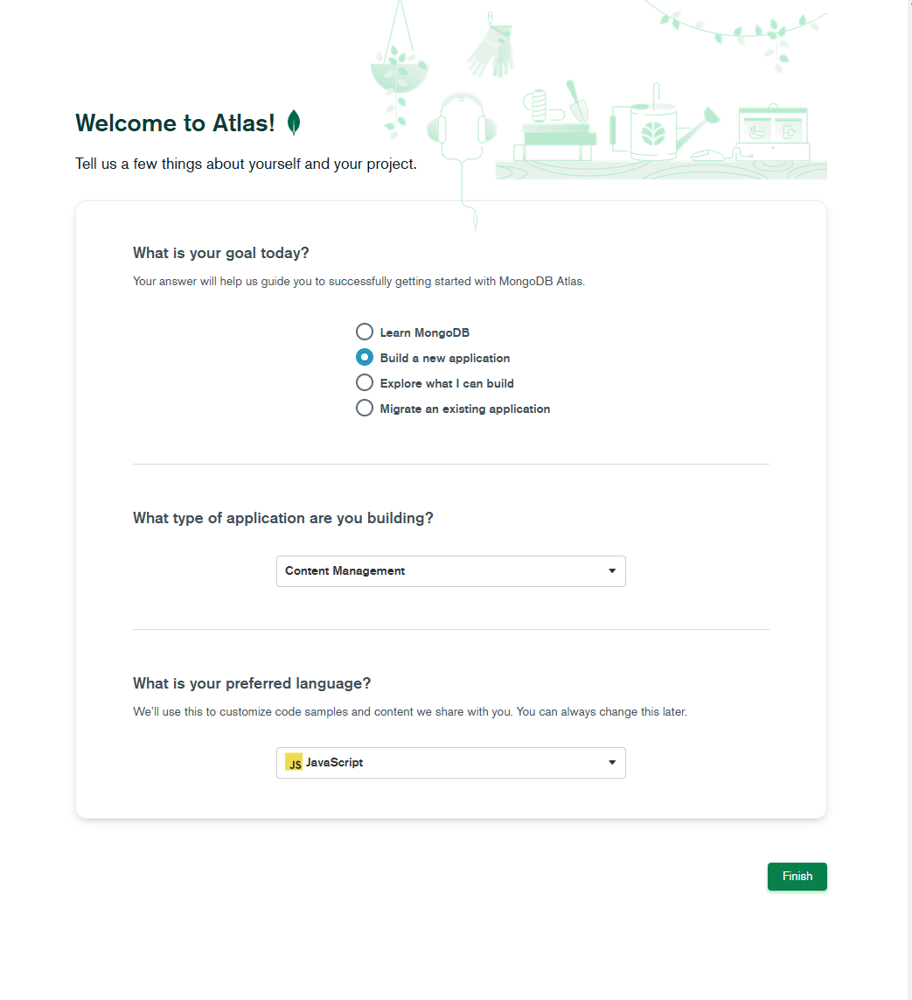

# ar-catalog

## Description

This project is about an easy to use experiment for true scaled images or 2D-sculptures in augmented reality.
AR-CAT was realized with a grant from the Leipzig Cultural Office. Thanks a lot for this great opportunity!
            
### Git

[Repository Link](https://github.com/evij-g/ar-catalog)

[try my AR-CAT here](https://arcat.evij.de)

### Documentation

If you want to set up your own "AR-CAT" do this:

1. clone this repository to your github account

## local development
I'm using VSCode. 

- create git repository on your local machine
- checkout your new cloned repository from github
- download mongodb and mongodb compass
- create a cloudinary account:
    1. go to: https://cloudinary.com/users/register/free
    2. select: Programmable Media for image and video API
    3. after your account is ready login on cloudinary
    4. 
- rename "bak.env" to ".env"
- paste your own cloudinary settings in ".env"-file
- open up a terminal within your git folder and run: npm run dev

## online deployment
2. create a cloudinary account:
    1. go to: https://cloudinary.com/users/register/free
    2. select: Programmable Media for image and video API
    3. after your account is ready login on cloudinary
    4. 
3. create a mongodb account:
    1. go to: https://www.mongodb.com/cloud/atlas/register
    
    2. after your account is ready, login on mongodb
    3.  
        
        
        
        
        
        
        
        
        
        
        
        
4. create a heroku account:
    1. go to: https://cloudinary.com/users/register/free
    2. select: Programmable Media for image and video API
    3. after your account is ready login on heroku
    4. 

### missing features

1. public space integration => exhibition in public space
-  show a map (open street map) and mark all located artworks nearby
- - the user has to allow the location detection
- - admin should be able to set current location (GPS - coordinates) for each artwork