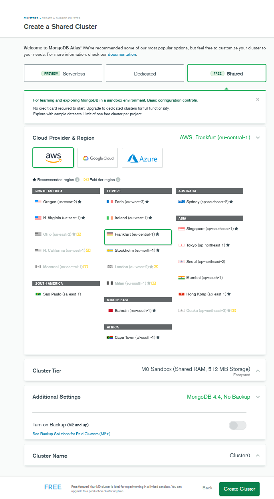

# AR-CATalog

## Description

This project is about an easy to use experiment for true scaled images or 2D-sculptures in augmented reality.
AR-CAT was realized with a grant from the Leipzig Cultural Office. Thanks a lot for this great opportunity!

If you have some questions or need help, just write me a message.
            
### Git

[Repository Link](https://github.com/evij-g/ar-catalog)

[try my AR-CAT here](https://arcat.evij.de)

### Documentation

If you want to set up your own "AR-CAT" do this:

1. clone this repository to your github account

## local development
I'm using VSCode. 

- create git repository on your local machine
- checkout your new cloned repository from github
- download mongodb and mongodb compass
- create a cloudinary account:
    1. go to: https://cloudinary.com/users/register/free
    2. select: Programmable Media for image and video API
    3. after your account is ready login on cloudinary
    4. 
- rename ".env.bak" to ".env"
- paste your own cloudinary settings in ".env"-file   
it should look like this:
```
# Server
PORT=3000

# DB
MONGODB_URL=mongodb://localhost/ar-catalog

# session
SESS_SECRET=''

# cloudinary
CLOUDINARY_NAME=
CLOUDINARY_KEY=
CLOUDINARY_SECRET=
```

- open up a terminal within your git folder and run: npm run all
- on first run, just save /mybulma/sass/mystyles.scss. 


## online deployment
2. create a cloudinary account:
    1. go to: https://cloudinary.com/users/register/free
    2. select: Programmable Media for image and video API
    3. after your account is ready login on cloudinary
    4. 
3. create a mongodb account:
    1. go to: https://www.mongodb.com/cloud/atlas/register
    
    2. after your account is ready, login on mongodb
    3.  
        
        
        
        
        
        
        
        
    4. import data
    select "elements" collection on left pane
    
    
    ## elements
    ```json 
    [{
    "_id": {
        "$oid": "61d1c58b1ecf245bd55f2157"
    },
    "markerId": 0,
    "markerLink": "https://raw.githubusercontent.com/evij-g/artoolkit-barcode-markers-collection/master/4x4_bch_13_9_3/0.png",
    "title": "VerbrecherEvij",
    "width": 70,
    "height": 170,
    "position": "0 3 -1",
    "rotation": "0 0 0",
    "imageUrl": "https://res.cloudinary.com/drjenyidb/image/upload/v1641137546/ar-catalog/pu5bwxyb4r5efh4lur6y.png",
    "material": "photo",
    "__v": 0,
    "resizefactor": "",
    "scale": "5 12.5 1"
    },{
    "_id": {
        "$oid": "61d967b34f71d262424756c5"
    },
    "markerId": 1,
    "markerLink": "https://raw.githubusercontent.com/evij-g/artoolkit-barcode-markers-collection/master/4x4_bch_13_9_3/1.png",
    "title": "carve in half",
    "width": 90,
    "height": 50,
    "position": "",
    "rotation": "",
    "scale": "5.29 2.94 1",
    "resizefactor": "",
    "imageUrl": "https://res.cloudinary.com/drjenyidb/image/upload/v1641637810/ar-catalog/hbdnk5lcsqkmng4vde9g.jpg",
    "material": "woodcut",
    "__v": 0,
    "markerSize": 17
    }]
    ``` 

    ## markers
    open markers.json from ar-js-marker folder. 
    it should look like this:
    ```json 
    [{
    "_id": {
        "$oid": "61c1c8447fb5b888f515e891"
    },
    "markerId": 0,
    "markerLink": "https://raw.githubusercontent.com/evij-g/artoolkit-barcode-markers-collection/master/4x4_bch_13_9_3/0.png",
    "inUse": true
    },{
    "_id": {
        "$oid": "61c1c8447fb5b888f515e892"
    },
    "markerId": 1,
    "markerLink": "https://raw.githubusercontent.com/evij-g/artoolkit-barcode-markers-collection/master/4x4_bch_13_9_3/1.png",
    "inUse": true
    }
    ``` 
    copy all within this file and import it like you did with "elements"

4. create a heroku account:
    1. go to: https://cloudinary.com/users/register/free
    2. select: Programmable Media for image and video API
    3. after your account is ready login on heroku
    4. create new app
    
    
    
    
    5. connection settings  
    - you have to add your own data and create these variables by clicking on "Add"
    
    - fill in your settings (cloudinary, mongodb) like in your .env file
    
5. open on your local enviroment /routes/index.js and edit line 37:
`   .get("/signup", isAdmin, getSignup)
`
to 
`   .get("/signup", isAnon, getSignup)
`

6. if you now commit some changes to your github repository, heroku will rebuild the app
7. have fun


### missing features

1. public space integration => exhibition in public space
-  show a map (open street map) and mark all located artworks nearby
- - the user has to allow the location detection
- - admin should be able to set current location (GPS - coordinates) for each artwork